# Minh Quang Truong Portfolio

## I. Personal Data


### 1. Bio
>Quang is a college graduate from George Brown College with the average GPA of 3.9. He passionate about modern technology and the process of digital adoption. Seeking web developer position.

### 2. Cover Letter
[Link to cover letter](https://drive.google.com/file/d/1gy76HUFjp9j5KBldNUAaEybaTmULM8PR/view?usp=sharing)
### 3. Resume
[Link to resume](https://drive.google.com/file/d/1c4OMeSB0WLcc-zvif1cS6mECc-cZL9ZM/view?usp=sharing)

### 4. Career Goal 
>To become a web developer in the next 3 years. To achive this, I will develop proficient skills in Fullstack Development. I will also improve my organization skills and imbibe a problem-solving attitude
## II. Academic credentials
*September 2018 - April 2021*

```javascript
Diploma, George Brown College, GPA 3.9
T127, Computer Programer Analyst
```

## III. Academic work experience
### Academic work samples:
#### 1. Weather application: [Link to source code](https://github.com/minhquangtruong/101160445_comp3123_a2)
**Technology used: [React-Native Framework](https://reactnative.dev/)**
>This is an application that update the current weather conditions (temperature, precipitation, humidity, …) by displaying the data from an API call of  https://openweathermap.org/api

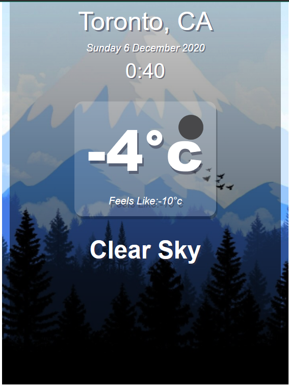

#### 2 . Machine learning project 1: [Link to source code](https://colab.research.google.com/drive/1YZt6svHcogQsq6lW9OjaLStMCtclsvYA?usp=sharing)
**Technology used: [Google collab](https://colab.research.google.com)**

>A machine learning project that identifies images of fashion icons with 90%+ accuracy using model from Keras.

**Demonstation video:**
<a href="http://www.youtube.com/watch?feature=player_embedded&v=9shEro6sy_k
" target="_blank"></a>

#### 3 . Machine learning project 2: [Link to source code](https://colab.research.google.com/drive/1PZlJcb1gijXOl22ZzfcVYm2KPYOa4jkf?usp=sharing)
**Technology used: [Google collab](https://colab.research.google.com)**

>This project uses machine learning to implement a multiclass classification using Iris classical dataset. The idea is to intensify what I have learned from the first project

**Demonstation video:**
<a href="http://www.youtube.com/watch?feature=player_embedded&v=eXkV_b-vmdo
" target="_blank"></a>

#### 1. Restaurant Guide: [Link to source code](https://github.com/minhquangtruong/101160445_comp3123_a2)
**Technology used: [Android Studio](https://developer.android.com/studio)**
>This is an Android application capable of CRUD (Create, Read, Update, Delete) restaurant information using SQLite. You can bookmark your favorite restaurant and get direction from your current location.

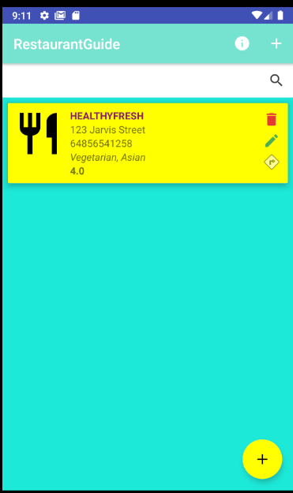

### Captone Project:
#### 1. Project Summary: [Link](https://drive.google.com/file/d/1PYDs_CBmVc09QATua5o7He37hPhog6Mz/view?usp=sharing)
>Dungeon explorer is a turn-based game where the player will try to clear the campaign by completing a set objective created. The game will use a system of dice rolling to determine the outcome of the player’s action. By completing the quest, the player will be rewarded accordingly.

#### 2. Project Vision: [Link](https://drive.google.com/file/d/1P8sWyDxJkrlZdEeHyDCSXCyrv4v4V8xy/view?usp=sharing)
>**Executive statement**
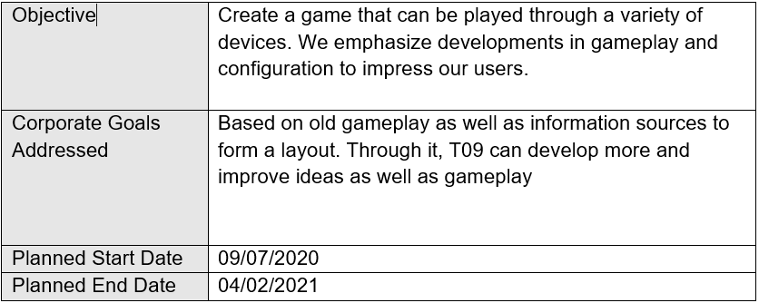

>**Deliverables**
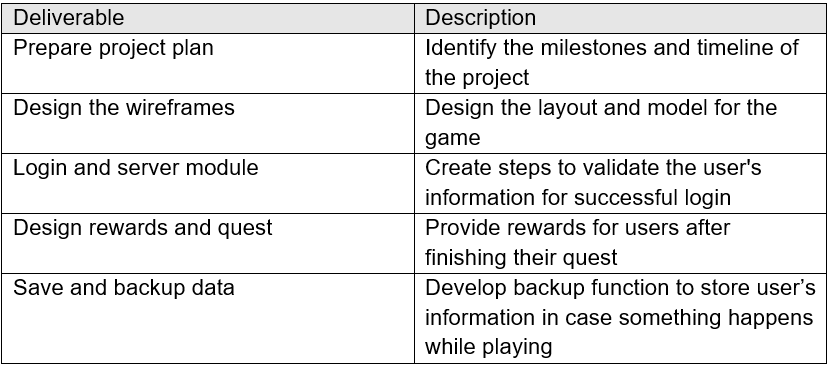

>**Gantt Chart**
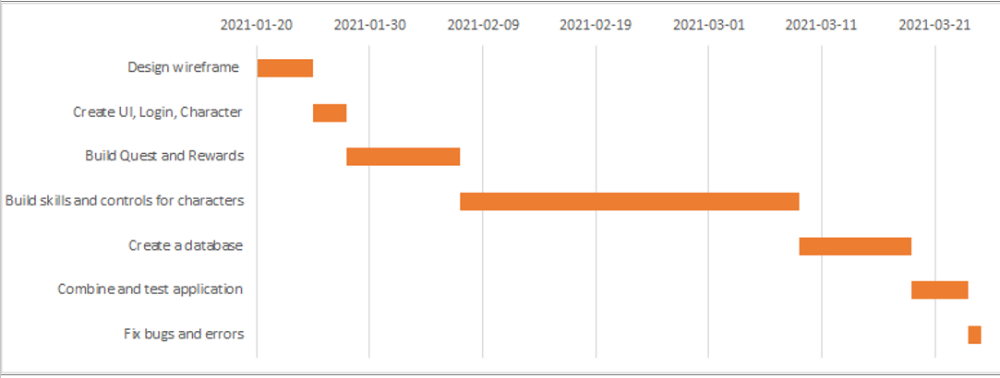

#### 3. Requirements Analysis and Design: [Link](https://drive.google.com/file/d/17LOr5W2Ru8v7tZdd0rh-yAG49vIra8vD/view?usp=sharing)
>**System Overview**
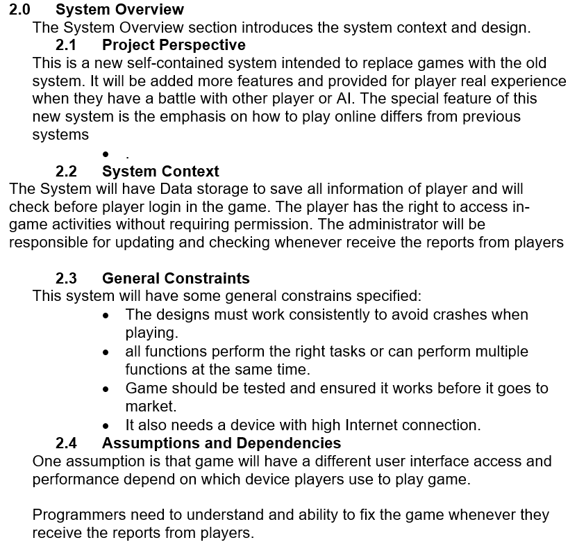

>**Data Model**
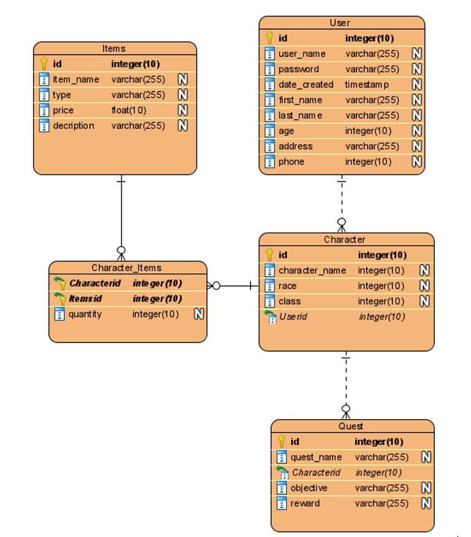

>**Model Sequence**
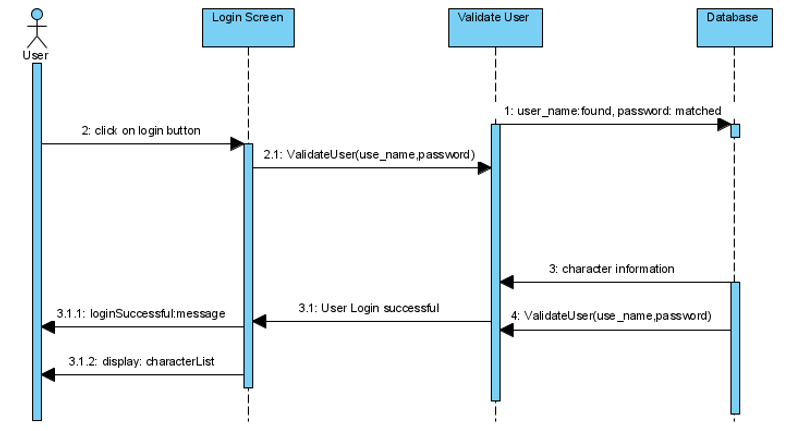

>**Data Flow**
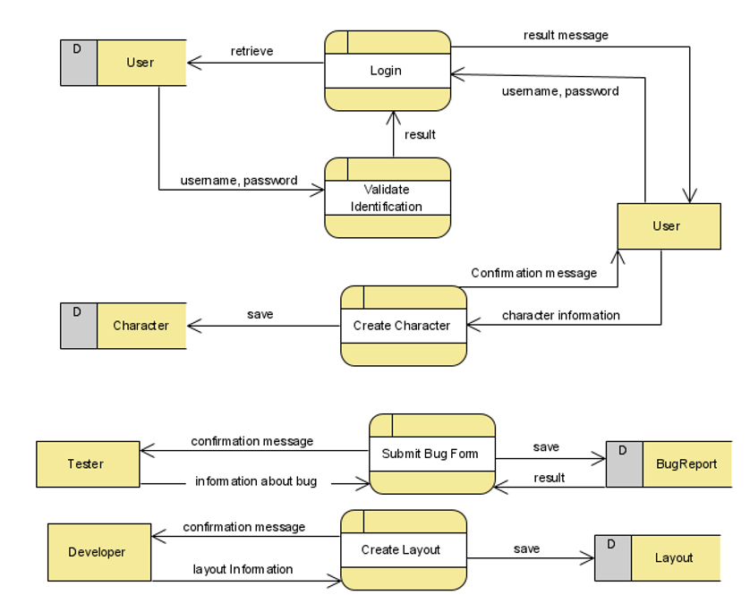

>**UML Diagram**
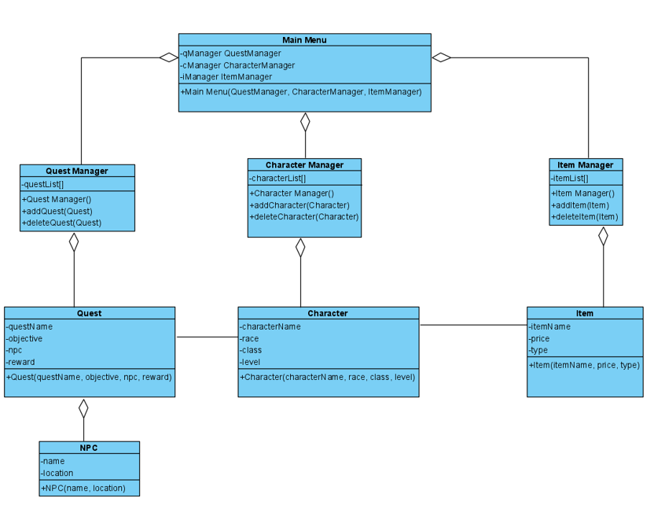

#### 4. WireFrames/ Mockups: [Link](https://drive.google.com/file/d/1WGvTaMBAVzwqijv4lqZEtZos1ejVBZIg/view?usp=sharing)
>**WireFrames**
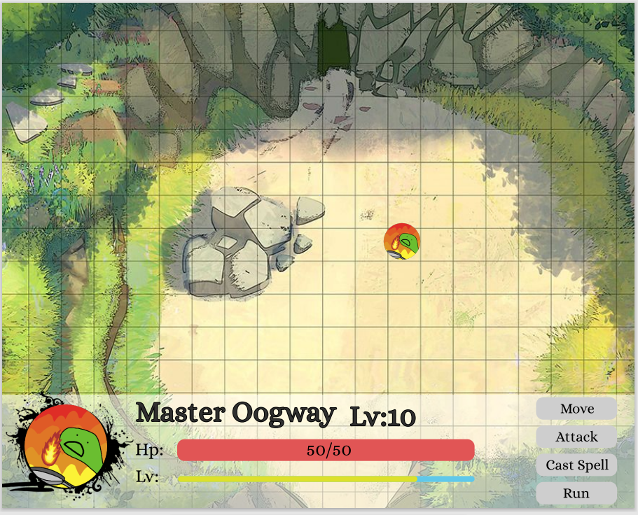

#### 5. Project Status Reports
**[Status Report 1](https://drive.google.com/file/d/1mGJr5pmvHSFQJcE2pgJnfmCWa4aiuXfZ/view?usp=sharing)**


#### 6. System Implementation
**[Github Repository](https://github.com/MinhQuang-Truong/Dungeon-Explorer)**
## IV. Professional summary
### Awards and Reconigtion:
**Dean’s Honors List on all of the semester**:

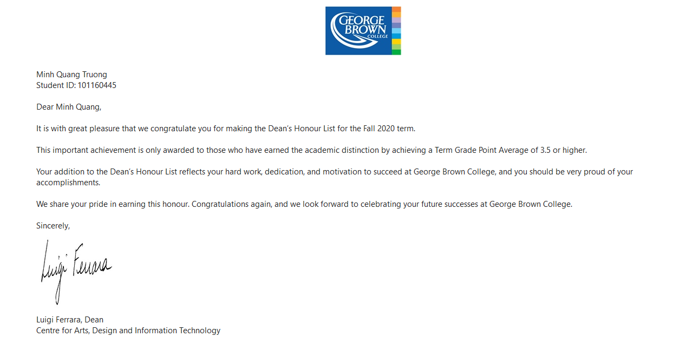